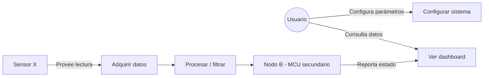

# 02. Requirements — [Nombre del Proyecto]

> Deriva de `01_Project_Brief.md`. Cada requisito debe tener un ID único porque en `06_Testing.md` vas a trazar cada test contra un ID de aquí. Si un requisito no se puede probar, no está bien escrito — reescríbelo.

---

## 1. Actores y casos de uso

> Un actor es cualquier cosa que interactúa con el sistema: una persona, otro dispositivo, un servidor, un sensor externo. No necesitas UML formal — un diagrama simple en Mermaid es suficiente y se renderiza directo en GitHub/Obsidian.

**Actores identificados:**

| Actor | Tipo | Descripción |
|-------|------|-------------|
| [Usuario] | Humano | |
| [Sensor externo] | Sistema | |
| [Nodo B / otro MCU] | Sistema | |
| [App/Dashboard] | Software | |

**Diagrama de casos de uso (Mermaid):**

**Tabla de casos de uso:**

| ID | Caso de uso | Actor principal | Precondición | Resultado esperado |
|----|-------------|------------------|---------------|---------------------|
| UC-01 | | | | |
| UC-02 | | | | |

---

## 2. Requisitos funcionales

| ID | Descripción | Prioridad (Must/Should/Could) | Origen (UC-xx) | Verificable por (Test ID) |
|----|-------------|-------------------------------|----------------|-----------------------------|
| RF-01 | El sistema debe [...] | Must | UC-01 | TC-01 |
| RF-02 | | | | |

## 3. Requisitos no funcionales

| ID | Categoría | Descripción | Meta / Umbral |
|----|-----------|-------------|-----------------|
| RNF-01 | Rendimiento | Tiempo de respuesta / latencia | ≤ [ms] |
| RNF-02 | Consumo energético | | ≤ [mA / mAh] |
| RNF-03 | Fiabilidad | MTBF / tasa de error | |
| RNF-04 | Usabilidad | | |
| RNF-05 | Mantenibilidad | Código documentado, módulos desacoplados | |
| RNF-06 | Seguridad/Safety | (si aplica: fail-safe, watchdog, límites) | |

## 4. Requisitos de hardware *(omitir si no aplica — ver 01_Project_Brief §9)*

| ID | Descripción | Valor / Rango |
|----|-------------|----------------|
| RH-01 | Alimentación de entrada | [V] |
| RH-02 | Consumo máximo | [mA] |
| RH-03 | Interfaces de comunicación requeridas | [UART / SPI / I2C / CAN / Wi-Fi / BLE] |
| RH-04 | Rango de operación (temperatura, humedad) | |
| RH-05 | Dimensiones máximas / factor de forma | |
| RH-06 | Sensores/actuadores requeridos | |

## 5. Requisitos de software

| ID | Descripción | Plataforma objetivo |
|----|-------------|-----------------------|
| RS-01 | | [ESP-IDF / STM32CubeIDE / CCS / Python host] |
| RS-02 | | |

## 6. Requisitos regulatorios / normativos *(omitir si no aplica)*

| ID | Norma/estándar | Aplica a | Nota |
|----|------------------|----------|------|
| RN-01 | | | |

## 7. Matriz de trazabilidad (resumen)

> Se completa a medida que avanzas; el detalle fino vive en `06_Testing.md`.

| Requisito | Diseño (sección en 04_Design.md) | Test (ID en 06_Testing.md) | Estado |
|-----------|-----------------------------------|-------------------------------|--------|
| RF-01 | | | ⬜ Pendiente |
| RH-01 | | | ⬜ Pendiente |
