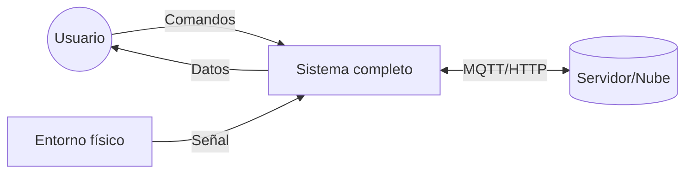
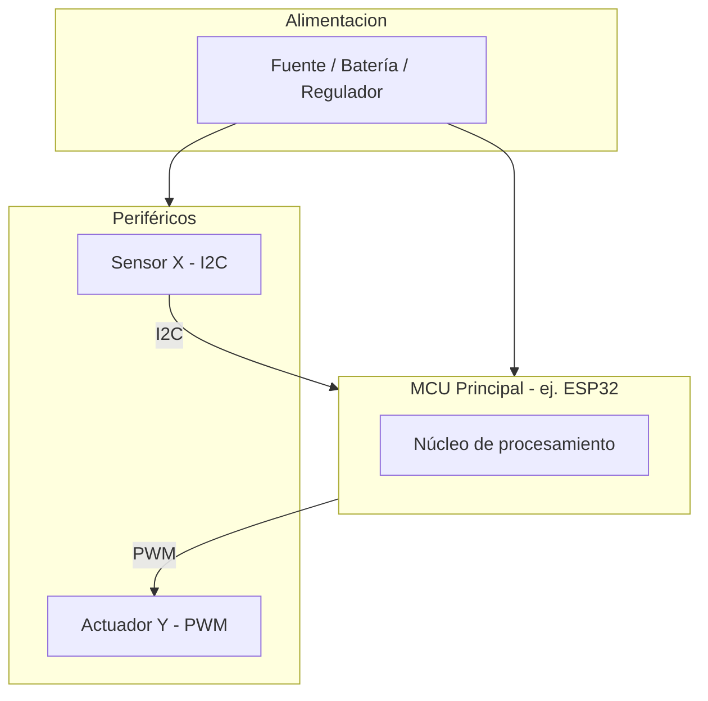
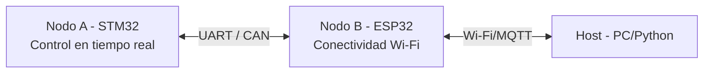
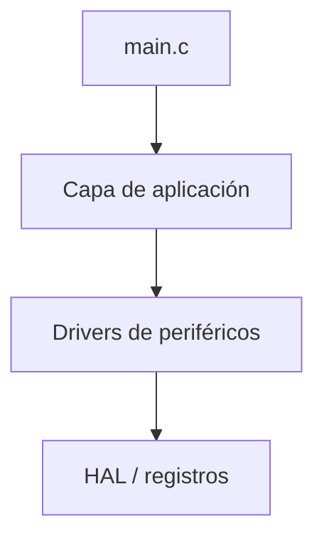

# 03. System Architecture — [Nombre del Proyecto]

> Aquí defines la forma del sistema ANTES del detalle de diseño (eso va en `04_Design.md`). Responde: ¿qué bloques existen y cómo se conectan? Usa diagramas de bloques, no de clases (eso es diseño, no arquitectura).

---

## 1. Vista de contexto del sistema

> El sistema completo como una caja negra: qué entra, qué sale, con qué interactúa afuera (usuario, red, otros sistemas).

## 2. Arquitectura de hardware *(omitir si el proyecto no incluye hardware propio)*

**Diagrama de bloques físico:**

**Tabla de bloques de hardware:**

| Bloque | Función | Componente clave | Interfaz con el resto |
|--------|---------|--------------------|--------------------------|
| | | | |

**Presupuesto de energía (si aplica):**

| Bloque | Voltaje | Corriente típica | Corriente pico |
|--------|---------|---------------------|-------------------|
| | | | |

## 3. Topología multi-nodo *(solo si hay más de un MCU/procesador — ver 01_Project_Brief Q5)*

> Define quién es "maestro", qué hace cada nodo, y el protocolo/bus entre ellos. Esto es distinto de la arquitectura de un solo MCU: aquí el diagrama es de **red**, no de bloques internos.

| Nodo | Rol | Plataforma / SDK | Responsabilidad | Protocolo hacia otros nodos |
|------|-----|--------------------|--------------------|-------------------------------|
| Nodo A | | STM32CubeIDE | | |
| Nodo B | | ESP-IDF | | |
| Host | | Python | | |

**Justificación de la partición** (por qué esta tarea va en este nodo y no en otro): [...]

## 4. Arquitectura de software

> Elige el enfoque según §9 de `01_Project_Brief.md`.

**Si es procedural/bare-metal (típico en C embebido):**
- Diagrama de módulos (no clases): capas típicas `main → app/lógica → drivers → HAL/BSP`.

**Si es orientado a objetos (C++/Python de alto nivel):**
- Diagrama de clases preliminar → detallarlo en `04_Design.md`. Aquí solo el mapa de paquetes/módulos.

**Stack tecnológico:**

| Capa | Tecnología | Motivo |
|------|-------------|--------|
| Firmware nodo A | C / STM32CubeIDE / HAL | |
| Firmware nodo B | C / ESP-IDF / FreeRTOS | |
| Software host | Python 3.x / [librería] | |
| Comunicación | [MQTT/HTTP/UART/CAN] | |

## 5. Arquitectura de datos (si el sistema procesa/almacena datos)

- Formato de datos entre módulos: [JSON / struct binario / CSV]
- Persistencia: [SD card / flash interna / base de datos / ninguna]

## 6. Vista de despliegue *(si aplica: dónde vive físicamente cada pieza)*

[Diagrama o tabla: qué corre en el MCU, qué corre en el PC, qué corre en la nube]

---

**Referencias cruzadas:** decisiones arquitectónicas relevantes se documentan como ADR en `07_Decisions.md` (ej. "¿por qué UART y no CAN entre nodos?").
