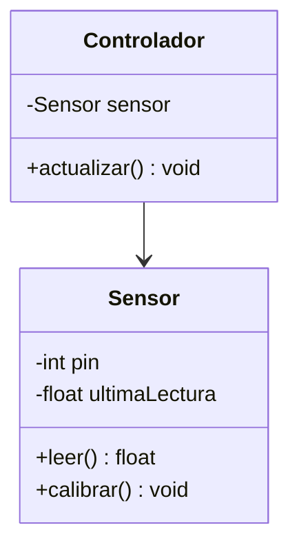
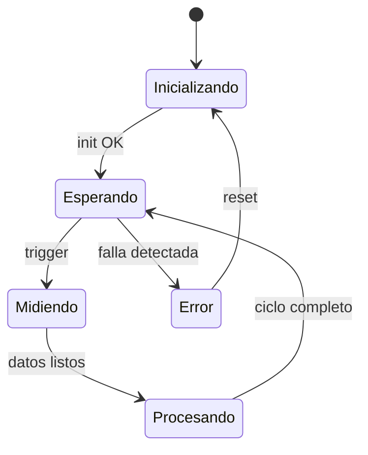
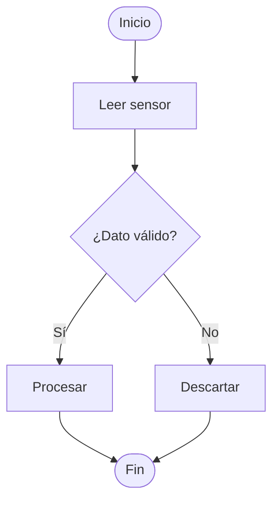

# 04. Design — [Nombre del Proyecto]

> Aquí bajas de "bloques" (arquitectura) a "cómo se construye cada bloque". Usa solo las secciones que apliquen (ver checklist de `01_Project_Brief.md` §9); borra el resto.

---

## 1. Diseño de lógica / software

### 1.1 Si es orientado a objetos (C++/Python) → Diagrama de clases

| Clase | Responsabilidad | Colabora con |
|-------|-------------------|----------------|
| | | |

### 1.2 Si es procedural/bare-metal (C embebido) → Diagrama de flujo / máquina de estados

**Máquina de estados** (para lógica de control, secuencias, modos de operación):

**Diagrama de flujo** (para algoritmos/rutinas puntuales, ej. una ISR o un filtro):

### 1.3 Diseño de módulos / API interna (C)

| Módulo (.c/.h) | Función pública | Descripción |
|------------------|--------------------|--------------|
| `sensor_x.c/.h` | `sensor_x_init()`, `sensor_x_read()` | |
| `comm.c/.h` | | |

**Manejo de dependencias / librerías por entorno:**

| Entorno | Gestor de librerías | Convención de este proyecto |
|---------|------------------------|-------------------------------|
| ESP-IDF | `idf_component.yml` / ESP Component Registry | Componentes propios en `/firmware/nodo_b/components/` |
| STM32CubeIDE | Librerías HAL generadas + libs externas en `/Drivers` | Libs de terceros como submódulo git en `/firmware/nodo_a/lib/` |
| Code Composer Studio | SysConfig + TI Driverlib | Documentar versión exacta del SDK usada en este archivo |
| Python (host) | `requirements.txt` / `venv` | Congelar versiones (`pip freeze`) |

> Regla: **cada entorno con su propio subproyecto**, no mezclar código de distintos SDKs en la misma carpeta. Un `README.md` corto dentro de cada subcarpeta de firmware explica cómo compilar/flashear ese nodo específico.

## 2. Diseño de hardware / circuito *(omitir si no aplica)*

- **Esquemático:** [link a `/hardware/schematics/`, herramienta usada: KiCad/Altium/EasyEDA]
- **Selección de componentes clave y justificación:**

| Componente | Alternativas consideradas | Elegido por |
|------------|-------------------------------|--------------|
| | | |

- **Cálculos de diseño** (divisores, filtros, disipación, etc.): [link a notebook/hoja de cálculo o inline]

## 3. Diseño de PCB *(omitir si no aplica)*

- Stack-up: [# capas]
- Consideraciones de placement/routing relevantes: [...]
- Archivo fuente: `/hardware/pcb/[nombre].kicad_pro`
- Gerbers/exports: `/hardware/pcb/exports/`

## 4. Modelado físico / mecánico *(omitir si no aplica)*

- Herramienta: [FreeCAD / Fusion360 / SolidWorks]
- Modelo: `/mechanical/[archivo]`
- Consideraciones: tolerancias, materiales, ensamblaje

## 5. Simulación *(omitir si no aplica)*

> Distingue el tipo de simulación — cada una vive en su propia subcarpeta y se referencia aquí.

| Tipo | Herramienta | Qué se valida | Ubicación en repo |
|------|-------------|-------------------|----------------------|
| Circuito (SPICE) | LTspice / ngspice | [ej. respuesta en frecuencia del filtro] | `/simulation/circuit/` |
| Física/control | Python (scipy/control) / Simulink | [ej. respuesta del lazo de control] | `/simulation/control/` |
| Mecánica/térmica | [herramienta] | [ej. disipación térmica] | `/simulation/thermal/` |

**Resumen de resultados clave de simulación:** [tabla o gráfico embebido, con conclusión de una línea: "esto valida/invalida el diseño de §2"]

## 6. Diseño de interfaces

| Interfaz | Entre | Protocolo | Formato de datos |
|----------|-------|-----------|---------------------|
| | Nodo A ↔ Nodo B | UART 115200 8N1 | Struct empaquetado, ver `/firmware/common/protocol.h` |

## 7. Decisiones de diseño relevantes

> Enlaza aquí los ADR de `07_Decisions.md` que afectan este documento (ej. ADR-003: elección de I2C sobre SPI para el sensor X).
