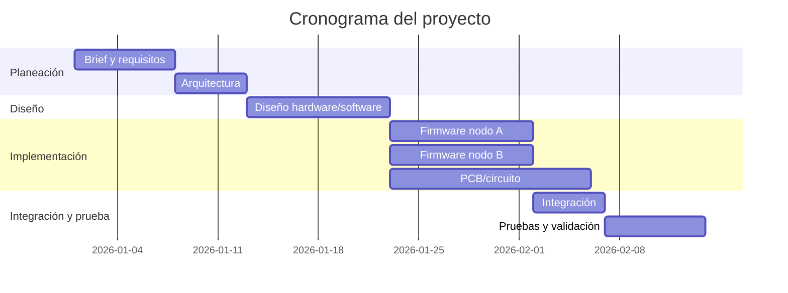

# 05. Project Plan — [Nombre del Proyecto]

> El plan no reemplaza a GitHub Issues/Projects — los complementa. Aquí va la vista de alto nivel (hitos, fases); el detalle día a día vive en el tablero de GitHub Projects del repo.

---

## 1. Fases del proyecto

| Fase | Objetivo | Entregable | Documento asociado |
|------|----------|------------|-----------------------|
| 0. Planeación | Definir problema y requisitos | 01–03 completos | Este mismo repo |
| 1. Diseño | Arquitectura y diseño detallado cerrados | 04 completo | `04_Design.md` |
| 2. Implementación | Hardware fabricado / firmware funcional | Prototipo v1 | Código en `/firmware`, `/hardware` |
| 3. Integración | Todos los nodos/módulos comunicándose | Sistema integrado | |
| 4. Validación | Requisitos verificados | Reporte de pruebas | `06_Testing.md` |
| 5. Documentación final | Portafolio-ready | README + este handbook completo | |

## 2. Cronograma (alto nivel)

## 3. Desglose de tareas (WBS resumido)

> El detalle vivo va en GitHub Issues, etiquetados por fase (`fase:diseño`, `fase:firmware`, etc.) y milestone. Aquí solo el resumen de alto nivel.

| Milestone (GitHub) | Issues asociados | Estado |
|-----------------------|----------------------|--------|
| `M1 - Diseño cerrado` | #, #, # | ⬜ |
| `M2 - Prototipo v1` | | ⬜ |
| `M3 - Validación` | | ⬜ |

## 4. Recursos y BOM (Bill of Materials) *(si aplica hardware)*

| Ítem | Cantidad | Costo estimado | Proveedor | Lead time |
|------|----------|-------------------|-----------|-------------|
| | | | | |

**Costo total estimado:** [$]

## 5. Dependencias y bloqueos conocidos

| Dependencia | Bloquea a | Estado |
|-------------|-------------|--------|
| [ej: llegada de componente X] | [tarea/fase] | |

## 6. Definición de "hecho" (Definition of Done) por fase

- **Diseño:** todos los diagramas de `03` y `04` completos y revisados; ADRs de decisiones mayores registrados.
- **Implementación:** código compila sin warnings, firmware flasheado y corriendo en hardware real (no solo simulación).
- **Validación:** 100% de requisitos Must en la matriz de trazabilidad de `02_Requirements.md` con test PASSED.
